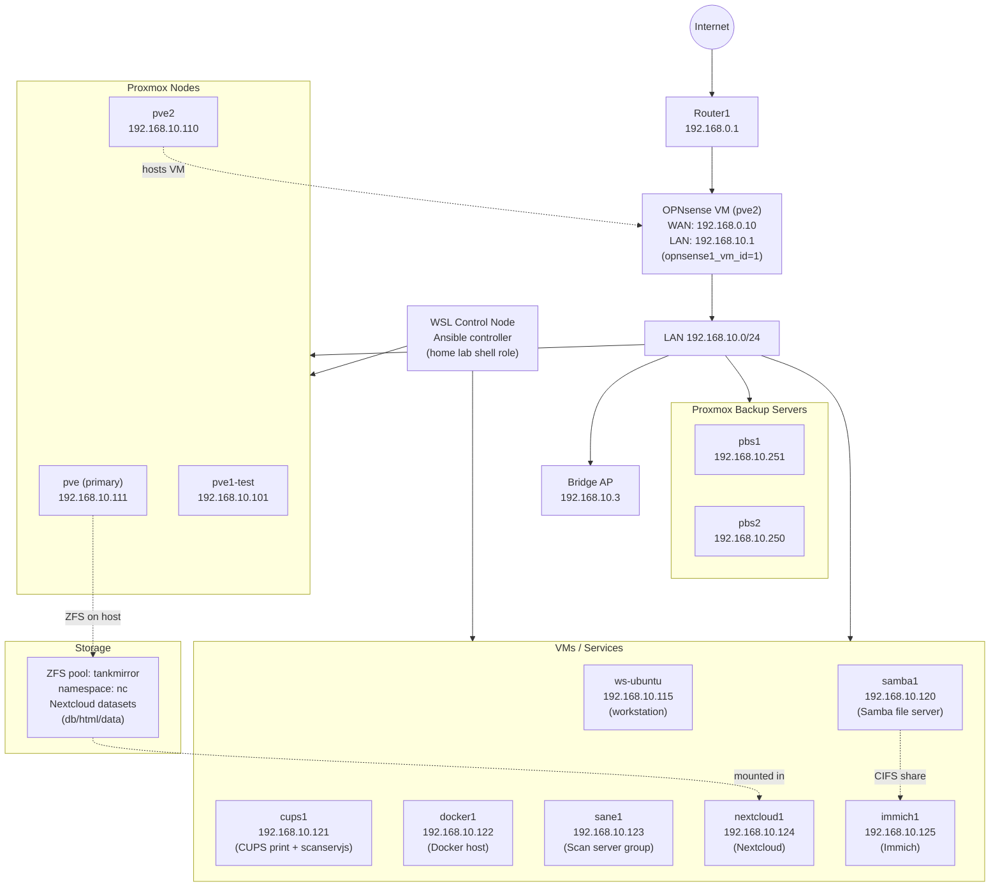

# Homelab Architecture

## Overview

Primary Proxmox node: `pve`  
Secondary Proxmox node: `pve2`  
Control node: WSL (Ansible controller)  
Gateway VM: OPNsense on `pve2`  

## Diagram (Mermaid)

```mermaid
flowchart TB
  Internet((Internet))
  Router1["Router1\n192.168.0.1"]
  OPNsense["OPNsense VM (pve2)\nWAN: 192.168.0.10\nLAN: 192.168.10.1\n(opnsense1_vm_id=1)"]
  LAN["LAN 192.168.10.0/24"]
  BridgeAP["Bridge AP\n192.168.10.3"]

  WSL["WSL Control Node\nAnsible controller\n(home lab shell role)"]

  subgraph Proxmox["Proxmox Nodes"]
    PVE["pve (primary)\n192.168.10.111"]
    PVE2["pve2\n192.168.10.110"]
    PVET["pve1-test\n192.168.10.101"]
  end

  subgraph Backup["Proxmox Backup Servers"]
    PBS1["pbs1\n192.168.10.251"]
    PBS2["pbs2\n192.168.10.250"]
  end

  subgraph VMs["VMs / Services"]
    WS["ws-ubuntu\n192.168.10.115\n(workstation)"]
    SAMBA["samba1\n192.168.10.120\n(Samba file server)"]
    CUPS["cups1\n192.168.10.121\n(CUPS print + scanservjs)"]
    DOCKER["docker1\n192.168.10.122\n(Docker host)"]
    SANE["sane1\n192.168.10.123\n(Scan server group)"]
    NC["nextcloud1\n192.168.10.124\n(Nextcloud)"]
    IM["immich1\n192.168.10.125\n(Immich)"]
  end

  subgraph Storage["Storage"]
    ZFS["ZFS pool: tankmirror\nnamespace: nc\nNextcloud datasets\n(db/html/data)"]
  end

  Internet --> Router1 --> OPNsense --> LAN --> BridgeAP
  LAN --> Proxmox
  LAN --> Backup
  LAN --> VMs
  WSL --> Proxmox
  WSL --> VMs

  PVE2 -. hosts VM .-> OPNsense
  PVE -. ZFS on host .-> ZFS
  ZFS -. mounted in .-> NC
  SAMBA -. CIFS share .-> IM
```

